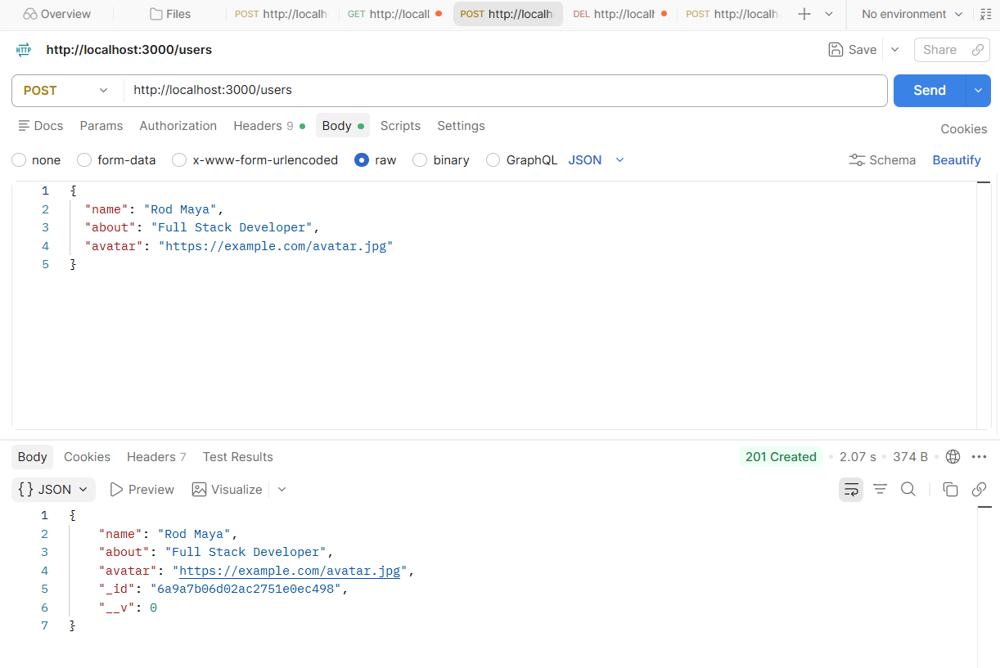
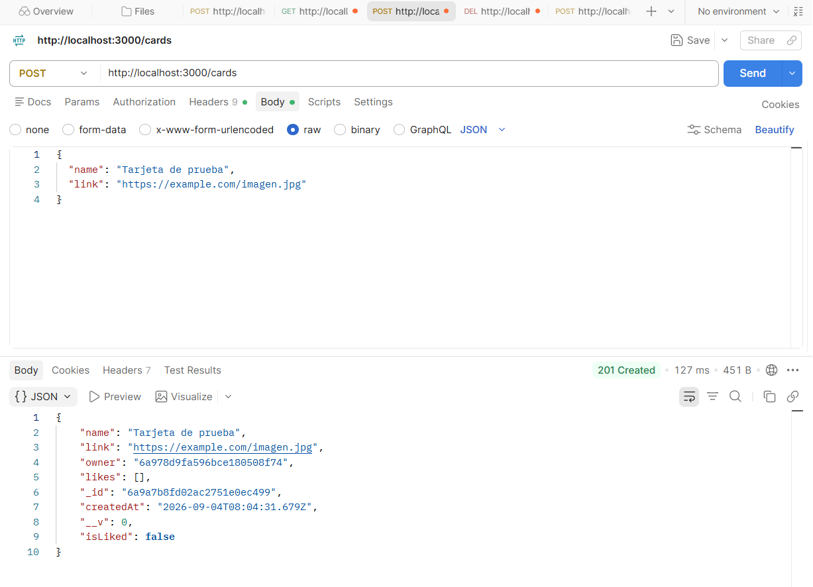
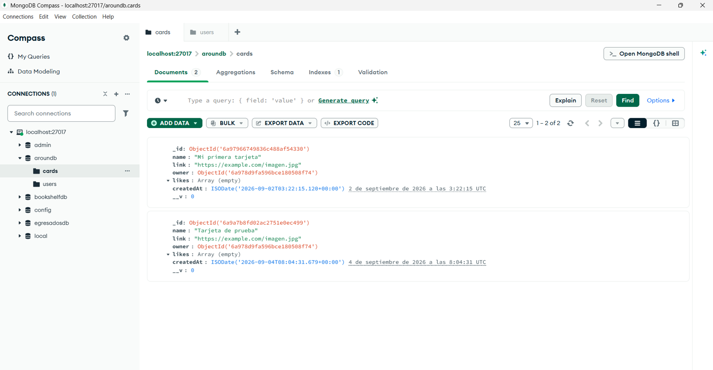
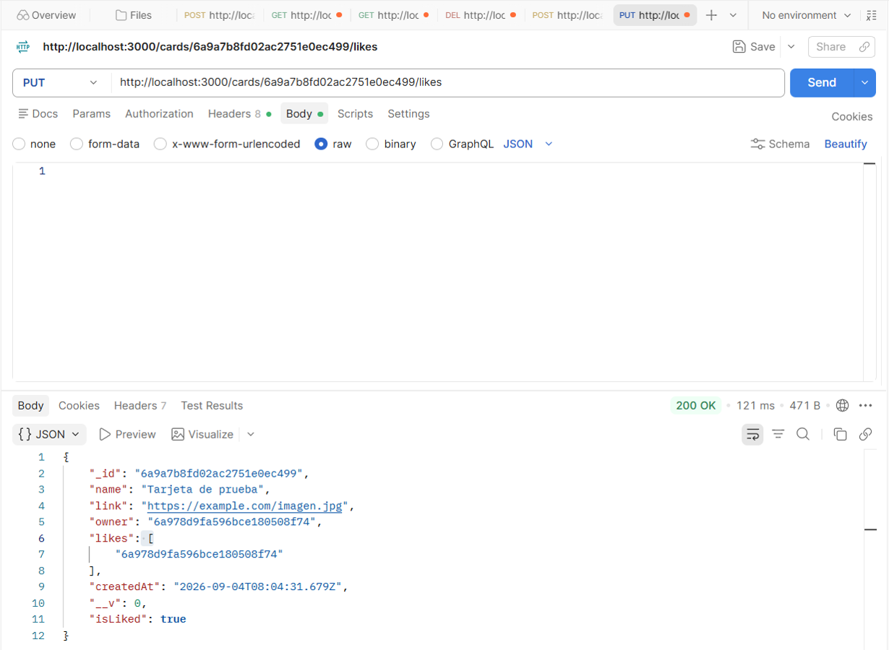
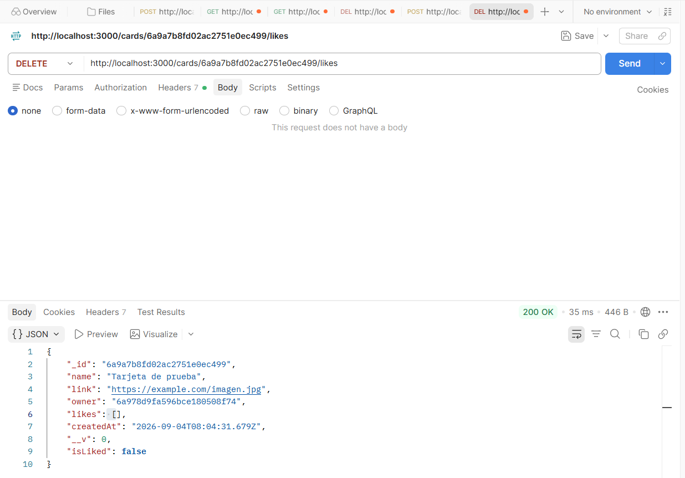
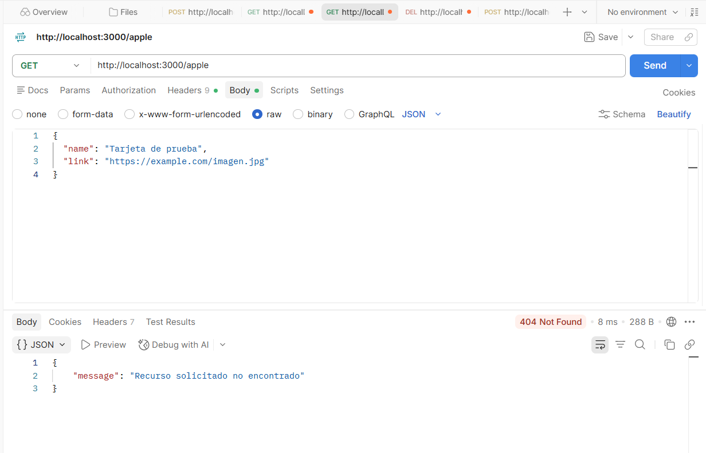
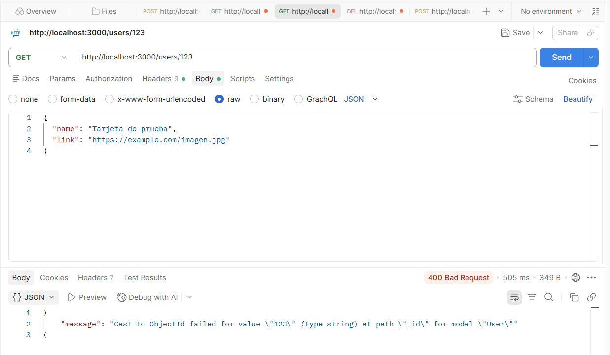
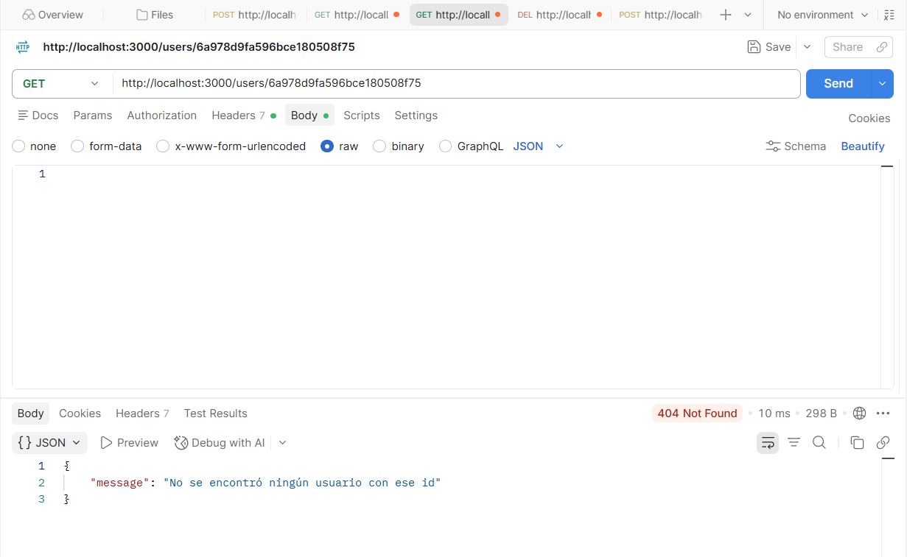

# Around the U.S. — Express + MongoDB REST API

A REST API built with **Express.js**, **TypeScript**, and **MongoDB (via Mongoose)** for the "Around the U.S." project. It manages two resources — **users** and **cards** — with schema validation, centralized error handling, and a like/dislike system for cards.

This project is part of the TripleTen Full Stack Web Development bootcamp (Sprint 14). It replaces the previous version's static JSON file storage with a real MongoDB database.

## Features

- Full CRUD for users and cards, backed by MongoDB.
- Schema-level validation (required fields, length limits, custom URL regex validation for `avatar` and `link`).
- Like / dislike system for cards using MongoDB's `$addToSet` and `$pull` operators, with a computed `isLiked` field on every card response.
- Temporary authorization middleware that attaches a fixed user `_id` to every request (a stand-in for authentication, which will be implemented in a later sprint).
- Centralized, type-safe error-handling middleware that maps Mongoose `ValidationError` / `CastError` to `400`, missing resources to `404`, and unexpected failures to `500`.
- Strict TypeScript configuration (ES Modules, `exactOptionalPropertyTypes`) and ESLint + Prettier for consistent code style.

## Technologies & Techniques

- **Node.js** + **Express 5** — server and routing
- **TypeScript** — static typing across routes, controllers, and models, including a custom `Express.Request` type augmentation for `req.user`
- **MongoDB** — document database
- **Mongoose** — schema definition, validation, and data access (`find`, `findById`, `create`, `findByIdAndUpdate`, `findByIdAndDelete`)
- **tsx** — hot-reload development server
- **ESLint** (`@eslint/js`, `typescript-eslint`) + **Prettier** — linting and formatting
- **Postman** — manual API testing during development
- Custom regular expression for URL validation (avatar/image links)

## Project Structure

```
web_project_around_express/
├── src/
│   ├── controllers/
│   │   ├── cards.ts
│   │   └── users.ts
│   ├── middleware/
│   │   └── errorHandler.ts
│   ├── models/
│   │   ├── card.ts
│   │   ├── user.ts
│   │   └── urlValidator.ts
│   ├── routes/
│   │   ├── cards.ts
│   │   ├── index.ts
│   │   └── users.ts
│   ├── types/
│   │   └── express/
│   │       └── index.d.ts
│   └── app.ts
├── .editorconfig
├── .gitignore
├── eslint.config.js
├── package.json
└── tsconfig.json
```

## API Reference

### Users

| Method | Route              | Description                                  |
| ------ | ------------------ | -------------------------------------------- |
| GET    | `/users`           | Get all users                                |
| GET    | `/users/me`        | Get the current user's profile               |
| GET    | `/users/:id`       | Get a user by ID                             |
| POST   | `/users`           | Create a user (`name`, `about`, `avatar`)    |
| PATCH  | `/users/me`        | Update the current user's `name` and `about` |
| PATCH  | `/users/me/avatar` | Update the current user's `avatar`           |

### Cards

| Method | Route              | Description                                                          |
| ------ | ------------------ | -------------------------------------------------------------------- |
| GET    | `/cards`           | Get all cards (includes computed `isLiked`)                          |
| POST   | `/cards`           | Create a card (`name`, `link`); owner is taken from the current user |
| DELETE | `/cards/:id`       | Delete a card by ID                                                  |
| PUT    | `/cards/:id/likes` | Like a card                                                          |
| DELETE | `/cards/:id/likes` | Remove a like from a card                                            |

### Error Responses

| Status | When it happens                                     |
| ------ | --------------------------------------------------- |
| 400    | Invalid data on create/update, or a malformed `_id` |
| 404    | The requested user, card, or route does not exist   |
| 500    | Unexpected server error                             |

All error responses are shaped as `{ "message": string }`.

## Getting Started

### Prerequisites

- Node.js
- A local MongoDB server running (`mongod`)

### Installation

```bash
npm install
```

### Running the project

Development (hot reload with `tsx`):

```bash
npm run dev
```

Production build:

```bash
npm run build
npm run start
```

The server runs on `http://localhost:3000` and connects to MongoDB at `mongodb://localhost:27017/aroundb`.

### Linting

```bash
npm run lint
```

## Screenshots / Demo

### Creating a user (Postman)

`POST /users` with `name`, `about`, and `avatar` in the request body.



### Creating a card (Postman)

`POST /cards` — the `owner` is resolved server-side from `req.user`, and the response includes the computed `isLiked` field.



### MongoDB Compass — `aroundb` database

The `users` and `cards` collections, created automatically on first document insert.



### Liking / disliking a card

`PUT /cards/:id/likes` and `DELETE /cards/:id/likes`, showing `isLiked` toggle between `true` and `false`.




### Error handling

**Unknown route → 404**
`GET /banana`



**Malformed ID → 400 (Mongoose CastError)**
`GET /users/123`



**Well-formed but non-existent ID → 404**
`GET /users/:id` with a valid but unassigned ObjectId.



## Author

**Rodrigo Maya**
[LinkedIn](https://linkedin.com/in/rod-maya) · [GitHub](https://github.com/rodmaya-dev) · [Portfolio](https://rodmaya-dev.github.io)
