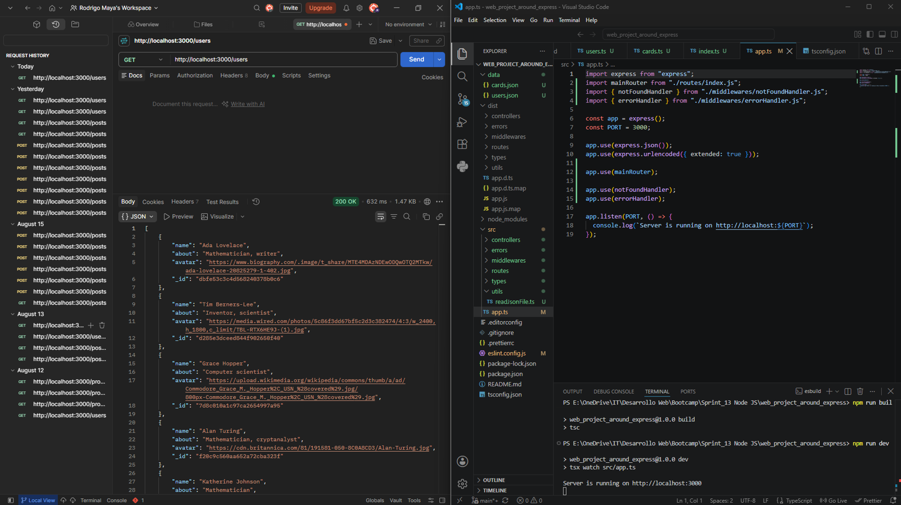
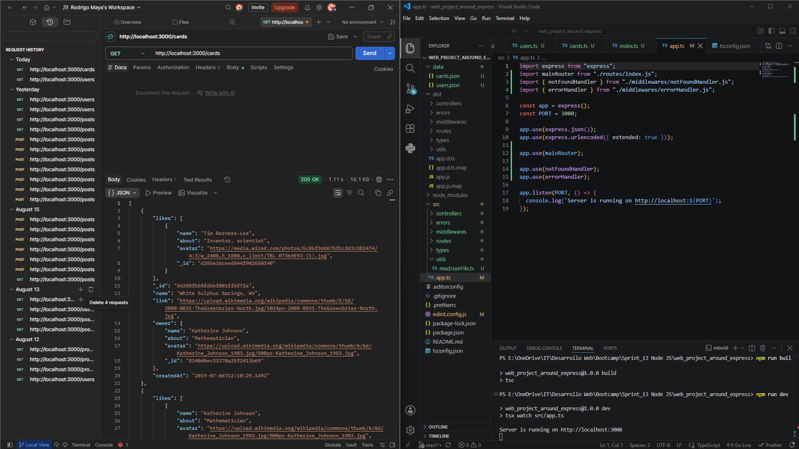
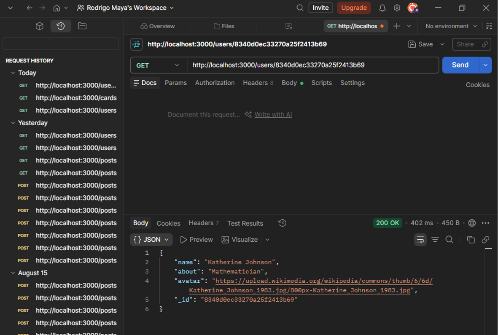
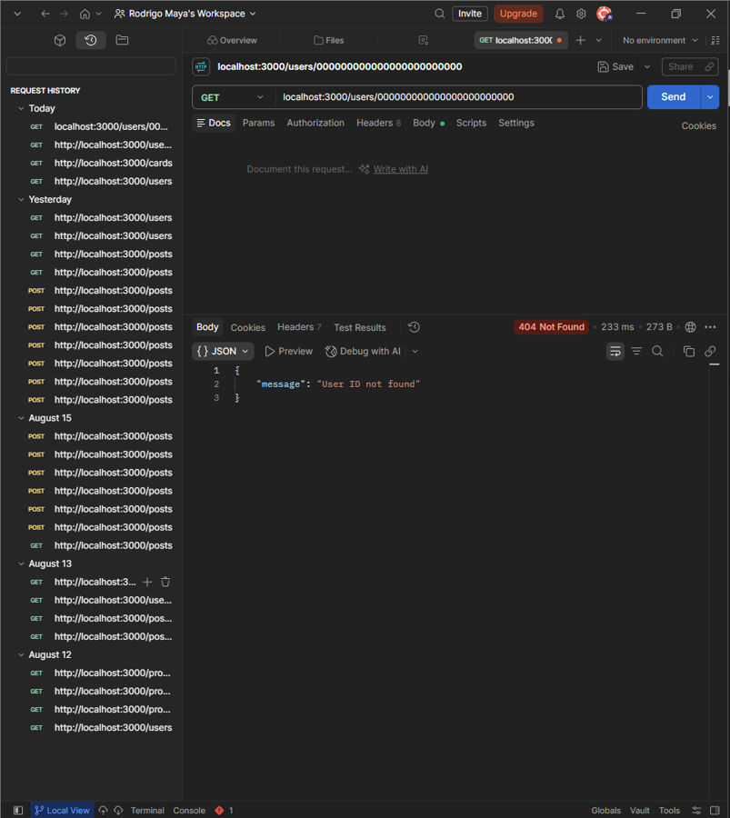
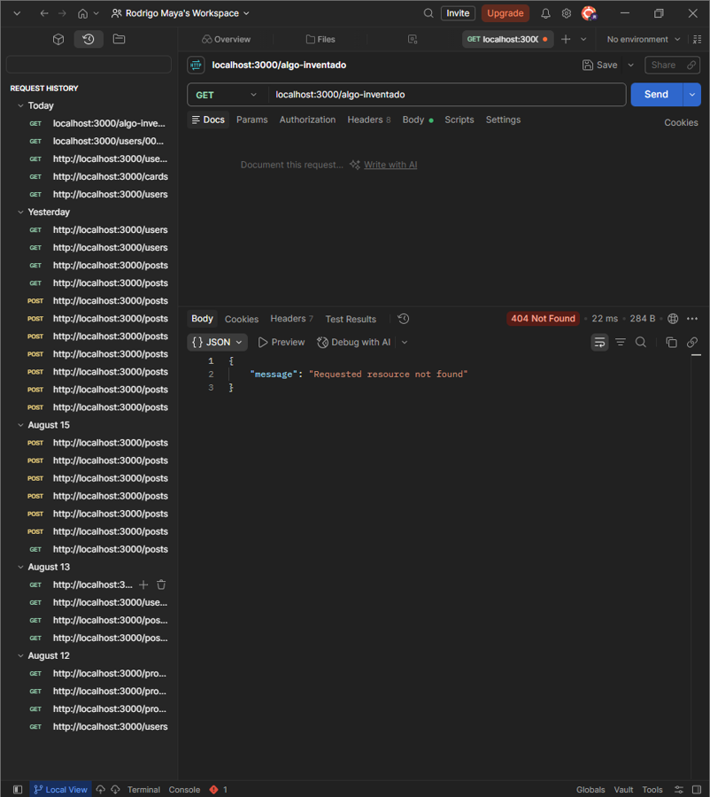

# Around the U.S. — Express API

## Descripción

API REST para el proyecto "Alrededor de los EE. UU.", construida con Node.js y Express como parte del bootcamp de Desarrollo Web Full Stack de TripleTen (Sprint 13). Esta es la primera iteración del backend: sirve datos de usuarios y tarjetas desde archivos JSON locales, y más adelante se conectará a una base de datos real y al frontend en React construido en sprints anteriores.

## Funcionalidades

- `GET /users` — devuelve la lista completa de usuarios en formato JSON.
- `GET /users/:userId` — devuelve un usuario específico por su ID, o un `404` con `{ "message": "User ID not found" }` si no existe ningún usuario con ese ID.
- `GET /cards` — devuelve la lista completa de tarjetas en formato JSON.
- Cualquier ruta no definida devuelve un `404` con `{ "message": "Requested resource not found" }`.
- Middleware centralizado de manejo de errores: devuelve `500` con `{ "message": "An error has ocurred on the server" }` ante errores inesperados.

## Tecnologías y técnicas utilizadas

- **Node.js** — entorno de ejecución de JavaScript del lado del servidor.
- **Express.js** — enrutamiento, middleware y manejo de solicitudes/respuestas.
- **TypeScript** — tipado estático, compilado con `tsc`.
- **ES Modules** (`import`/`export`) en todo el proyecto.
- **node:fs/promises** — lectura asíncrona y no bloqueante de los archivos de datos JSON.
- **node:path** + `import.meta.dirname` — construcción segura de rutas absolutas, independiente del sistema operativo.
- **ESLint** + **typescript-eslint** + **Prettier** — calidad y formato consistente del código.
- **tsx** — ejecución de TypeScript con hot reload para desarrollo local.
- Arquitectura modular: rutas, controladores, middlewares, errores, tipos y utilidades separados en sus propias carpetas.

## Estructura del proyecto

```
web_project_around_express/
├── data/
│   ├── cards.json
│   └── users.json
├── screenshots/
│   ├── prueba1.png
│   ├── prueba2.png
│   ├── prueba3.png
│   ├── prueba4.png
│   └── prueba5.png
├── src/
│   ├── controllers/
│   │   ├── cards.ts
│   │   └── users.ts
│   ├── errors/
│   │   └── NotFoundError.ts
│   ├── middlewares/
│   │   ├── errorHandler.ts
│   │   └── notFoundHandler.ts
│   ├── routes/
│   │   ├── cards.ts
│   │   ├── index.ts
│   │   └── users.ts
│   ├── types/
│   │   └── index.ts
│   ├── utils/
│   │   └── readJsonFile.ts
│   └── app.ts
├── .editorconfig
├── .gitignore
├── eslint.config.js
├── package.json
└── tsconfig.json
```

## Cómo ejecutar el proyecto

```bash
npm install        # instalar dependencias
npm run dev         # iniciar el servidor de desarrollo con hot reload en http://localhost:3000
npm run build        # compilar TypeScript desde src/ hacia dist/
npm start             # ejecutar el servidor compilado desde dist/
npm run lint           # ejecutar ESLint
```

## Pruebas de la API

Las siguientes solicitudes fueron probadas manualmente con Postman:

**GET /users** — devuelve la lista completa de usuarios.



**GET /cards** — devuelve la lista completa de tarjetas.



**GET /users/:userId** (ID existente) — devuelve un usuario específico.



**GET /users/:userId** (ID inexistente) — devuelve 404 con el mensaje de error esperado.



**GET a una ruta no definida** — devuelve 404 con el mensaje genérico de recurso no encontrado.


